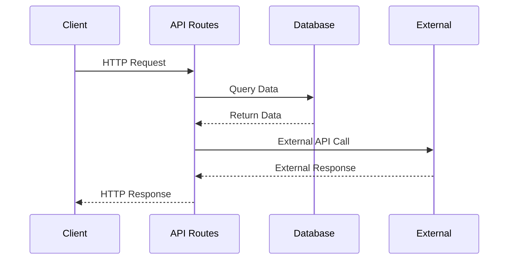

# QuarterTurn Marketplace - System Architecture Documentation

## Table of Contents
1. [Application Overview](#application-overview)
2. [Technical Stack](#technical-stack)
3. [Application Structure](#application-structure)
4. [Data Flow](#data-flow)
5. [Infrastructure](#infrastructure)
6. [Database Architecture](#database-architecture)
7. [Authentication & Authorization](#authentication--authorization)
8. [External Integrations](#external-integrations)
9. [Real-time Features](#real-time-features)
10. [Deployment Strategy](#deployment-strategy)
11. [Monitoring & Logging](#monitoring--logging)
12. [Security Architecture](#security-architecture)
13. [Backup & Recovery](#backup--recovery)
14. [Analytics & Reporting](#analytics--reporting)
15. [Additional Workflows & Data Flows](#additional-workflows--data-flows)
16. [Implementation Details](#implementation-details)
17. [Error Handling & Recovery](#error-handling--recovery)
18. [Organizational Structure](#organizational-structure)

## Application Overview

QuarterTurn Marketplace is a modern fitness equipment marketplace with advanced features including AI-powered search, real-time coaching, and comprehensive vendor management. This document outlines the complete technical architecture of the system.

### Core Features
- User authentication and role-based access control
- Real-time notifications and messaging
- File upload and storage management
- Payment processing and subscription handling
- Analytics and reporting dashboard
- AI-powered search and recommendations

## Technical Stack

### Frontend
- Next.js 14 (React framework)
- TypeScript
- TailwindCSS
- Framer Motion
- React Query
- Zustand (State Management)

### Backend
- Next.js API Routes
- Node.js Runtime
- WebSocket (Socket.io)
- Redis (Caching)
- PostgreSQL (Primary Database)

### Cloud Infrastructure
- AWS (Amazon Web Services)
- Docker
- GitHub Actions (CI/CD)

### External Services
- Stripe (Payments)
- OpenAI (AI Features)
- SendGrid (Email)
- AWS S3 (Storage)
- CloudFront (CDN)

## Application Structure

### Sitemap and Routes


### Component Hierarchy


### State Management Flow


## Data Flow

### API Communication Flow



### Real-time Communication


## Infrastructure

### AWS Architecture


### Network Topology


## Database Architecture

### Entity Relationship Diagram


### Data Models


## Authentication & Authorization

### Authentication Flow


### Role-Based Access Control


## External Integrations

### Payment Processing Flow


### File Upload Process


## Real-time Features

### WebSocket Architecture


### Notification System


## Deployment Strategy

### CI/CD Pipeline


### Environment Configuration


## Monitoring & Logging

### Logging Architecture


### Metrics Collection


## Security Architecture

### Security Layers


### Data Encryption

```mermaid
graph TD
    A[Data in Transit] --> B[TLS]
    A --> C[API Encryption]
    
    D[Data at Rest] --> E[S3 Encryption]
    D --> F[RDS Encryption]
```

## Backup & Recovery

### Backup Strategy

```mermaid
graph TD
    A[Daily Backups] --> B[S3]
    A --> C[RDS Snapshots]
    
    B --> D[Long-term Storage]
    C --> E[Point-in-time Recovery]
```

### Disaster Recovery

```mermaid
graph TD
    A[Primary Region] --> B[Cross-region Replication]
    B --> C[Backup Region]
    
    D[Recovery Plan] --> E[DNS Failover]
    D --> F[Data Sync]
```

## Analytics & Reporting

### Data Collection Flow

```mermaid
graph TD
    A[User Events] --> B[Event Collection]
    B --> C[Processing Pipeline]
    C --> D[Data Warehouse]
    D --> E[Analytics Dashboard]
```

### Reporting Architecture

```mermaid
graph TD
    A[Raw Data] --> B[ETL Pipeline]
    B --> C[Data Warehouse]
    C --> D[BI Tools]
    D --> E[Dashboards]
```

## Additional Workflows & Data Flows

### E-commerce Integration Flow

```mermaid
graph TD
    A[E-commerce Manager] --> B{Platform Selection}
    B --> C[Shopify Integration]
    B --> D[WooCommerce Integration]
    
    C --> E[Product Sync]
    C --> F[Inventory Sync]
    C --> G[Order Sync]
    
    D --> H[Product Sync]
    D --> I[Inventory Sync]
    D --> J[Order Sync]
    
    E --> K[Database]
    F --> K
    G --> K
    
    H --> K
    I --> K
    J --> K
```

### Inventory Management Flow

```mermaid
sequenceDiagram
    participant User
    participant System
    participant Inventory
    participant Platform
    
    User->>System: Initiate Stock Count
    System->>Inventory: Create Count Session
    User->>System: Submit Count
    System->>Inventory: Validate Count
    System->>Inventory: Calculate Adjustments
    System->>Platform: Update Stock Levels
    Platform-->>System: Confirmation
    System-->>User: Complete Count
```

### CRM Integration Flow

```mermaid
graph TD
    A[User Actions] --> B{Event Type}
    B --> C[Contact Creation]
    B --> D[Deal Creation]
    B --> E[Event Tracking]
    
    C --> F[HubSpot CRM]
    D --> F
    E --> F
    
    F --> G[Contact Management]
    F --> H[Deal Pipeline]
    F --> I[Analytics]
```

### Stock Movement Workflow

```mermaid
sequenceDiagram
    participant Source
    participant InventoryService
    participant Database
    participant Platforms
    
    Source->>InventoryService: Initiate Movement
    InventoryService->>Database: Create Movement Record
    InventoryService->>Database: Update Source Location
    InventoryService->>Database: Update Target Location
    InventoryService->>Platforms: Sync Changes
    Platforms-->>InventoryService: Confirmation
    InventoryService-->>Source: Movement Complete
```

### Data Synchronization Flow

```mermaid
graph TD
    A[Data Sources] --> B{Sync Manager}
    B --> C[Product Data]
    B --> D[Inventory Data]
    B --> E[Order Data]
    B --> F[Customer Data]
    
    C --> G[Master Database]
    D --> G
    E --> G
    F --> G
    
    G --> H[Platform Sync]
    G --> I[Analytics]
    G --> J[Reporting]
```

### Webhook Processing Flow

```mermaid
sequenceDiagram
    participant Platform
    participant WebhookHandler
    participant Services
    participant Database
    
    Platform->>WebhookHandler: Send Webhook
    WebhookHandler->>WebhookHandler: Validate Payload
    WebhookHandler->>Services: Process Event
    Services->>Database: Update Data
    Services->>Platform: Send Response
```

### Service Integration Architecture

```mermaid
graph TD
    A[Service Layer] --> B[E-commerce Services]
    A --> C[CRM Services]
    A --> D[Inventory Services]
    
    B --> E[Platform Adapters]
    C --> F[HubSpot Integration]
    D --> G[Stock Management]
    
    E --> H[Data Sync]
    F --> H
    G --> H
    
    H --> I[Master Database]
```

## Implementation Details

### E-commerce Integration
- Platform-agnostic service layer
- Unified product data model
- Real-time inventory sync
- Order processing pipeline
- Multi-platform support

### Inventory Management
- Stock counting system
- Movement tracking
- Location management
- Adjustment workflows
- Audit trail

### CRM Integration
- Contact management
- Deal tracking
- Event logging
- Customer journey mapping
- Analytics integration

### Data Synchronization
- Real-time sync
- Conflict resolution
- Error handling
- Retry mechanisms
- Data validation

### Service Architecture
- Microservices approach
- Event-driven design
- Scalable infrastructure
- Error handling
- Monitoring and logging

## Error Handling & Recovery

### Platform Sync Errors
- Automatic retry mechanism
- Error logging and notification
- Manual intervention options
- Data consistency checks
- Recovery procedures

### Inventory Discrepancies
- Automatic detection
- Reconciliation workflow
- Adjustment tracking
- Audit trail
- Alert system

### Service Integration Failures
- Circuit breaker pattern
- Fallback mechanisms
- Queue-based retry
- Manual override options
- Status monitoring

## Implementation Guidelines

### Development Standards
- Follow TypeScript strict mode
- Implement comprehensive error handling
- Use proper logging levels
- Write unit and integration tests
- Follow security best practices

### Code Organization
- Feature-based folder structure
- Shared components library
- Utility functions
- Type definitions
- API route handlers

### Security Considerations
- Input validation
- Output sanitization
- Rate limiting
- CORS policies
- Security headers
- Regular dependency updates

### Performance Optimization
- Code splitting
- Image optimization
- Caching strategies
- Database indexing
- Query optimization

### Monitoring Strategy
- Error tracking
- Performance metrics
- User analytics
- System health
- Security alerts

## Scaling Considerations

### Horizontal Scaling
- Container orchestration
- Load balancing
- Database replication
- Cache distribution
- Session management

### Vertical Scaling
- Resource optimization
- Query optimization
- Caching strategies
- Background processing
- Asset optimization

## Maintenance Procedures

### Regular Maintenance
- Database maintenance
- Log rotation
- Cache clearing
- Security updates
- Performance monitoring

### Emergency Procedures
- Incident response
- Rollback procedures
- Data recovery
- Communication plan
- Service restoration

## Documentation Guidelines

### Code Documentation
- API documentation
- Component documentation
- Type definitions
- Configuration guide
- Deployment guide

### User Documentation
- Admin guide
- Coach guide
- Client guide
- API guide
- Integration guide

# Organizational Structure

## Executive Team

### Chief Executive Officer (CEO)
- Strategic leadership and vision
- Business development
- Stakeholder management
- Company culture development
- Final decision-making authority

### Chief Technology Officer (CTO)
- Technical vision and strategy
- Architecture oversight
- Technology stack decisions
- Security governance
- Technical team leadership

### Chief Operating Officer (COO)
- Day-to-day operations
- Process optimization
- Vendor relationships
- Customer service oversight
- Operational efficiency

### Chief Marketing Officer (CMO)
- Marketing strategy
- Brand development
- Customer acquisition
- Content strategy
- Partnership development

### Chief Financial Officer (CFO)
- Financial planning
- Budget management
- Investment strategy
- Risk management
- Compliance oversight

## Technical Team

### Engineering Manager (Reports to CTO)
- Team leadership (3-5 developers per team)
- Sprint planning
- Code review oversight
- Technical mentorship
- Performance management

#### Frontend Development Team
- Senior Frontend Developer (Team Lead)
- 2-3 Frontend Developers
- UI/UX Developer
Responsibilities:
- Next.js/React development
- Component library maintenance
- Performance optimization
- Responsive design
- Accessibility compliance

#### Backend Development Team
- Senior Backend Developer (Team Lead)
- 2-3 Backend Developers
- Database Administrator
Responsibilities:
- API development
- Database optimization
- Service integration
- Performance monitoring
- Security implementation

#### DevOps Team
- DevOps Engineer (Team Lead)
- Cloud Infrastructure Engineer
- Security Engineer
Responsibilities:
- CI/CD pipeline
- Infrastructure management
- Security monitoring
- Performance optimization
- Disaster recovery

### Product Team

#### Product Manager
- Product strategy
- Feature prioritization
- User story creation
- Stakeholder communication
- Market research

#### UX/UI Design Team
- UX/UI Design Lead
- 2 UX/UI Designers
- User Researcher
Responsibilities:
- User experience design
- Interface design
- User research
- Usability testing
- Design system maintenance

## Operations Team

### Customer Success Manager
- Customer onboarding
- Account management
- Support escalation
- Customer feedback
- Retention strategy

#### Support Team
- Support Team Lead
- 3-4 Customer Support Representatives
- Technical Support Specialist
Responsibilities:
- Customer inquiries
- Technical support
- Issue resolution
- Documentation
- User training

### Vendor Relations Manager
- Vendor onboarding
- Relationship management
- Quality control
- Performance monitoring
- Vendor support

#### Vendor Support Team
- Vendor Support Lead
- 2-3 Vendor Support Specialists
Responsibilities:
- Vendor onboarding
- Technical assistance
- Issue resolution
- Performance optimization
- Best practices guidance

## Marketing Team

### Digital Marketing Manager
- Marketing campaigns
- SEO/SEM strategy
- Social media management
- Content strategy
- Analytics and reporting

#### Marketing Team
- Content Marketing Specialist
- Social Media Manager
- SEO Specialist
- Marketing Analytics Expert
Responsibilities:
- Content creation
- Social media presence
- Search optimization
- Performance tracking
- Campaign management

### Growth Marketing Manager
- User acquisition
- Conversion optimization
- A/B testing
- Marketing automation
- Partnership development

## Finance & Administration

### Finance Manager
- Accounting oversight
- Financial reporting
- Budget management
- Audit preparation
- Compliance monitoring

#### Finance Team
- Senior Accountant
- Financial Analyst
- Accounts Payable/Receivable Specialist
Responsibilities:
- Financial operations
- Revenue tracking
- Expense management
- Financial analysis
- Compliance maintenance

### HR Manager
- Recruitment
- Employee relations
- Benefits management
- Training programs
- Policy development

#### HR Team
- HR Coordinator
- Training Specialist
- Recruitment Specialist
Responsibilities:
- Hiring process
- Employee onboarding
- Benefits administration
- Training coordination
- Policy implementation

## Initial Hiring Priority (First 10 Hires)

1. CTO
2. Senior Full-Stack Developer
3. Product Manager
4. UX/UI Designer
5. Customer Success Manager
6. DevOps Engineer
7. Marketing Manager
8. Backend Developer
9. Frontend Developer
10. Customer Support Representative

## Scaling Plan (Years 1-3)

### Year 1 (15-20 employees)
- Core technical team
- Basic support structure
- Essential operations

### Year 2 (30-40 employees)
- Expanded development teams
- Full customer support
- Complete marketing team

### Year 3 (50-75 employees)
- Specialized teams
- Regional expansion
- Advanced operations

## Remote Work Considerations

### Hybrid Work Model
- Core hours for collaboration
- Flexible work locations
- Regular team meetings
- Digital-first communication
- Collaboration tools

### Office Requirements
- Collaboration spaces
- Meeting rooms
- Technical infrastructure
- Social areas
- Training facilities

## Team Communication Structure

```mermaid
graph TD
    A[CEO] --> B[CTO]
    A --> C[COO]
    A --> D[CMO]
    A --> E[CFO]
    
    B --> F[Engineering Manager]
    F --> G[Frontend Team]
    F --> H[Backend Team]
    F --> I[DevOps Team]
    
    C --> J[Customer Success]
    C --> K[Vendor Relations]
    
    D --> L[Digital Marketing]
    D --> M[Growth Marketing]
    
    E --> N[Finance Manager]
    E --> O[HR Manager]
```

## Department Interaction Flow

```mermaid
flowchart TD
    A[Product Team] --> B[Engineering]
    A --> C[Design]
    
    B --> D[DevOps]
    B --> E[QA]
    
    F[Marketing] --> G[Customer Success]
    F --> H[Sales]
    
    I[Operations] --> J[Support]
    I --> K[Vendor Relations]
    
    L[Finance] --> M[HR]
    L --> N[Legal] 