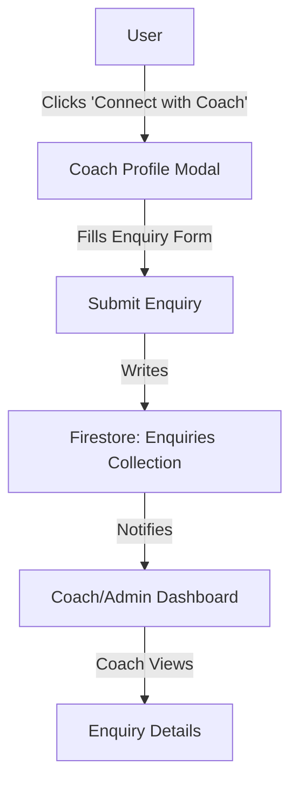
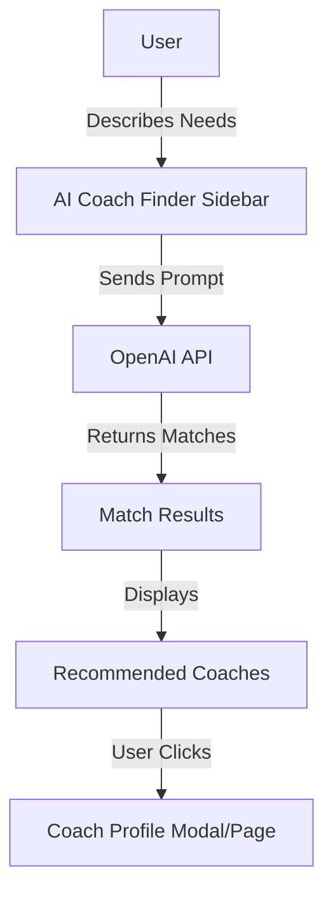
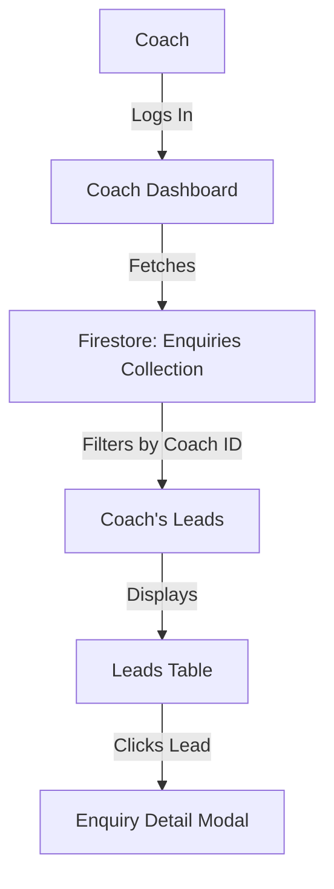
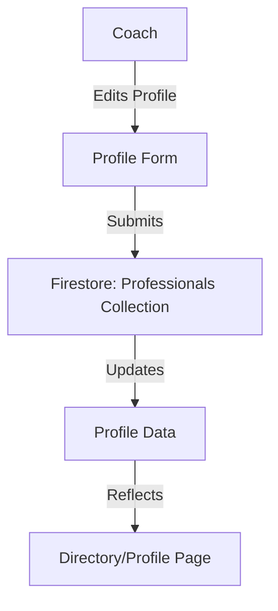

# Fitness Directory Platform - Dataflows (Mermaid.js)

## 1. User Browsing & Coach Directory

```mermaid
flowchart TD
    A[User] -->|Visits| B[Home/Directory Page]
    B -->|Fetches| C[Firestore: Professionals Collection]
    C -->|Returns| D[Coach List (Mock + Real)]
    D -->|Displays| E[Directory UI]
    E -->|User Filters/Sorts| D
    E -->|Clicks Coach| F[Coach Profile Modal/Page]
    F -->|Fetches| G[Firestore: Coach Details]
    G -->|Returns| H[Profile Data]
```

---

## 2. Connect with Coach (Enquiry Flow)



---

## 3. AI Coach Finder



---

## 4. Coach Dashboard (Leads/Enquiries)



---

## 5. Profile Editing (Coach)

